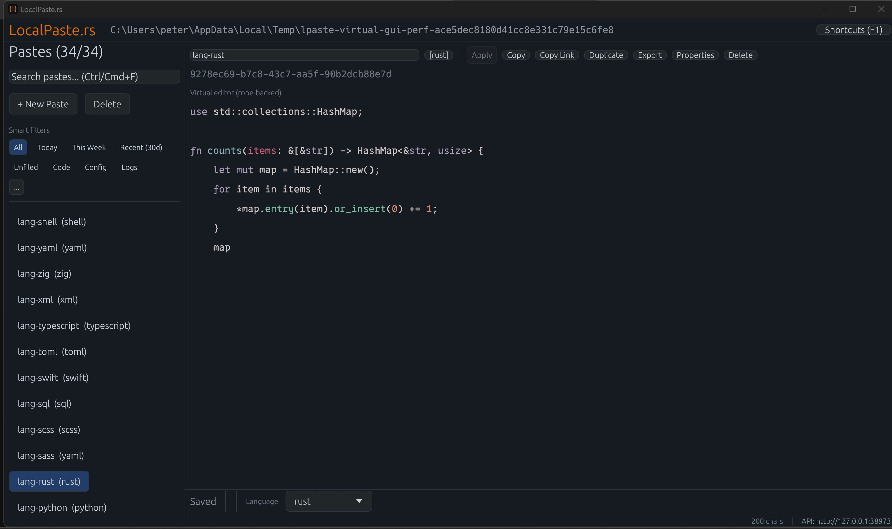

# LocalPaste.rs

A fast, localhost-only pastebin with a modern editor, built in Rust.



## What It Is

LocalPaste provides:

- Native desktop GUI (`localpaste-gui`) as the primary UX
- Headless API server (`localpaste`) for automation/integration
- CLI client (`lpaste`) for terminal workflows

Runtime note:
- `localpaste-gui` opens and owns the DB path, and runs an embedded API endpoint for compatibility while GUI is open.
- `localpaste` is the headless alternative and should not be run concurrently on the same `DB_PATH` as the GUI.

## Quick Start

```bash
# Desktop GUI
cargo run -p localpaste_gui --bin localpaste-gui
```

Canonical build/run/validation command matrices are maintained in:
[docs/dev/devlog.md](docs/dev/devlog.md).

## Configuration And Ops

- Security and environment variables: [docs/security.md](docs/security.md)
- Service/background operation: [docs/deployment.md](docs/deployment.md)
- Locking semantics (owner lock + paste edit locks): [docs/dev/locking-model.md](docs/dev/locking-model.md)
- Documentation source-of-truth map: [docs/README.md](docs/README.md)

## License

MIT
## Documentation map
Use these repository documents as the source of truth:
- Docs index: [docs/README.md](docs/README.md)
- Security: [docs/security.md](docs/security.md)
- Deployment: [docs/deployment.md](docs/deployment.md)
- Development log and architecture notes: [docs/dev/devlog.md](docs/dev/devlog.md)
- Contribution and automation protocol: [AGENTS.md](AGENTS.md)
