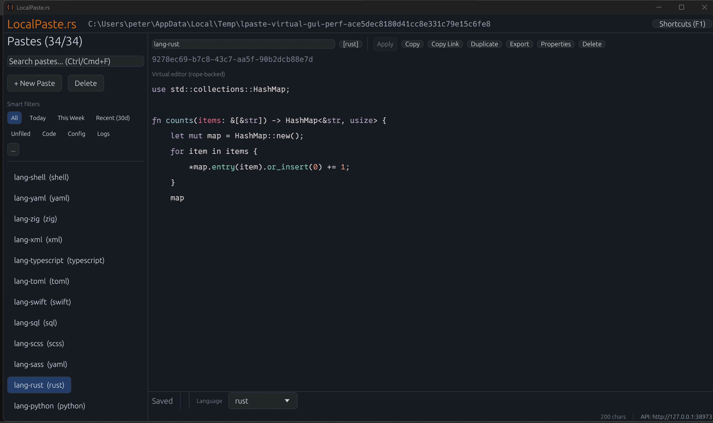

# LocalPaste.rs

A fast, localhost-only pastebin with a modern editor, built in Rust.



## What It Is

LocalPaste provides:

- Native desktop GUI (`localpaste-gui`) as the primary UX
- Headless API server (`localpaste`) for automation/integration
- CLI client (`lpaste`) for terminal workflows

> [!WARNING]
> Keep exactly one writer process per `DB_PATH` (`localpaste-gui` or standalone `localpaste`).

## Quick Start

GUI is the default workspace target:

```bash
# Desktop GUI
cargo run

# Explicit GUI binary
cargo run -p localpaste_gui --bin localpaste-gui
```

Headless server + CLI flow:

```bash
# Terminal A: run server on default local endpoint (127.0.0.1:38411)
cargo run -p localpaste_server --bin localpaste

# Terminal B: create/list via CLI
echo "hello from quickstart" | cargo run -p localpaste_cli --bin lpaste -- new --name "quickstart"
cargo run -p localpaste_cli --bin lpaste -- list --limit 5
```

If your server is not on the default endpoint, set `LP_SERVER` (or pass `--server`):

```bash
# bash example
export LP_SERVER="http://127.0.0.1:38973"

# powershell example
$env:LP_SERVER="http://127.0.0.1:38973"
```

Language detection and highlighting defaults:

- `localpaste_gui` and `localpaste_server` enable `magika` by default.
- `localpaste_cli` stays heuristic-only by default.
- Feature/runtime details: [`docs/language-detection.md`](docs/language-detection.md).

## Precompiled Binaries

GitHub Releases publish GUI assets under `localpaste-*` filenames.
`lpaste` and the standalone `localpaste` server are source-built with Cargo.
Artifact names, platform coverage, checksums, and macOS signing/notarization behavior are in
[`docs/release-gui.md`](docs/release-gui.md).

## Configuration and Ops

- Documentation map: [`docs/README.md`](docs/README.md)
- Practical terminal workflows alongside the GUI: [`docs/cli-gui-workflows.md`](docs/cli-gui-workflows.md)
- Detection, normalization, and highlighting: [`docs/language-detection.md`](docs/language-detection.md)
- Build/run/validation workflow: [`docs/dev/devlog.md`](docs/dev/devlog.md)
- Security, storage, and service operations: [`docs/security.md`](docs/security.md), [`docs/storage.md`](docs/storage.md), [`docs/deployment.md`](docs/deployment.md)
- GUI release pipeline and artifact contract: [`docs/release-gui.md`](docs/release-gui.md)

## License

MIT
