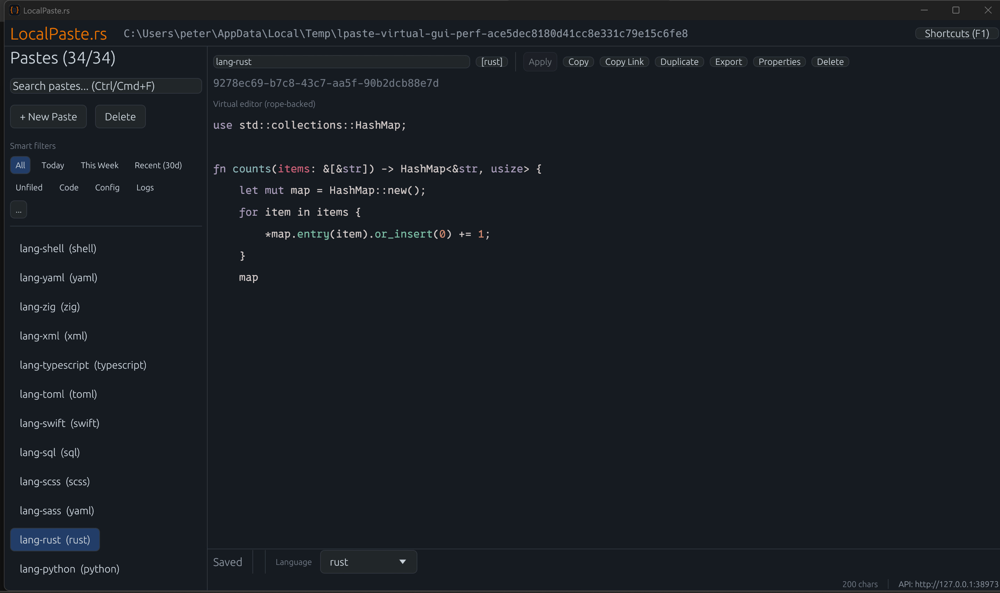

# LocalPaste.rs

Your local scratch layer for technical text that should be easy to save, search, edit, diff, and recover.



LocalPaste is for the text that lives between your clipboard, a repo, and a formal document: code snippets, logs, stack traces, config fragments, prompts, queries, links, notes, and half-formed fixes you do not want to lose.

It is local-first by design. The desktop app is the main workspace, backed by an embedded database on your machine. A localhost API and the `lpaste` CLI can use the same store, so terminal capture, scripts, and the GUI can fit into one workflow without sending sensitive material to a cloud pastebin.

> [!WARNING]
> Follow the [storage operational expectations](docs/storage.md#operational-expectations) when combining GUI, server, and CLI workflows.

## Why It Exists

Clipboard history is too transient. A repo is too heavy for every useful fragment. Cloud pastebins are the wrong default for secrets, logs, client data, and work-in-progress.

LocalPaste gives those scraps a durable home:

- paste first, organize later
- search by content, name, tags, language, and derived metadata
- edit in a code-aware desktop surface
- recover older versions when a scratch edit goes sideways
- automate through a CLI or localhost HTTP API when the terminal is faster

## Highlights

- **Fast capture**: paste into the app, or pipe text from the terminal. In the GUI, paste shortcuts outside the editor can create a new paste directly.
- **Technical-text editor**: syntax highlighting, language detection with Magika plus heuristic fallback, manual language overrides, large-buffer behavior, undo/redo, and keyboard-focused editing.
- **Searchable library**: recent items, smart collections, tags, language filters, metadata search, and full-content search help old fragments stay findable.
- **Version history**: content edits are snapshotted. You can inspect history, diff versions, duplicate an older snapshot, or hard-reset a paste.
- **Recovery paths**: destructive GUI delete flows use an undo window, and version history preserves earlier content until retention pruning applies.
- **Three interfaces, one local store**: native GUI (`localpaste-gui`), headless server (`localpaste`), and CLI (`lpaste`) share the same data model.
- **Local by default**: loopback binding, on-disk storage, no account, and no network dependency for day-to-day use.

## Quick Start

Run the desktop app:

```bash
cargo run
```

Or target the GUI binary explicitly:

```bash
cargo run -p localpaste_gui --bin localpaste-gui
```

Use the standalone server and CLI when you want a headless workflow:

```bash
# Terminal A: run the server on the default local endpoint, 127.0.0.1:38411
cargo run -p localpaste_server --bin localpaste

# Terminal B: create and list pastes through the CLI
echo "hello from quickstart" | cargo run -p localpaste_cli --bin lpaste -- new --name "quickstart"
cargo run -p localpaste_cli --bin lpaste -- list --limit 5
```

If the server is not on the default endpoint, pass `--server` or set `LP_SERVER`:

```bash
export LP_SERVER="http://127.0.0.1:38973"
```

```powershell
$env:LP_SERVER = "http://127.0.0.1:38973"
```

When the GUI is already running, `lpaste` can usually discover the GUI's embedded API for the same `DB_PATH`:

```bash
lpaste list --limit 20
lpaste search-meta validation
lpaste get <paste-id>
```

## Configuration Notes

- Language detection defaults: [`docs/language-detection.md#feature-topology`](docs/language-detection.md#feature-topology).
- Version history, server exposure, CORS, size limits, and backup settings: [`docs/security.md#environment-variables`](docs/security.md#environment-variables).
- Storage and single-writer rules: [`docs/storage.md`](docs/storage.md).

## Releases

GitHub Releases publish desktop GUI assets under `localpaste-*` filenames. The CLI (`lpaste`) and standalone server (`localpaste`) are source-built with Cargo.

Artifact names, platform coverage, checksums, and macOS signing/notarization behavior are documented in [`docs/release-gui.md`](docs/release-gui.md).

## Documentation

Start here:

- Terminal workflows with the GUI: [`docs/cli-gui-workflows.md`](docs/cli-gui-workflows.md)
- Language detection and highlighting: [`docs/language-detection.md`](docs/language-detection.md)
- Storage and durability: [`docs/storage.md`](docs/storage.md)
- Security and exposure model: [`docs/security.md`](docs/security.md)
- Deployment and service operations: [`docs/deployment.md`](docs/deployment.md)
- Full documentation map: [`docs/README.md`](docs/README.md)

For development:

- Build, validation, and smoke-test workflow: [`docs/dev/devlog.md`](docs/dev/devlog.md)
- GUI behavior notes and manual test checklist: [`docs/dev/gui-notes.md`](docs/dev/gui-notes.md)
- GUI release pipeline: [`docs/release-gui.md`](docs/release-gui.md)

## License

MIT
