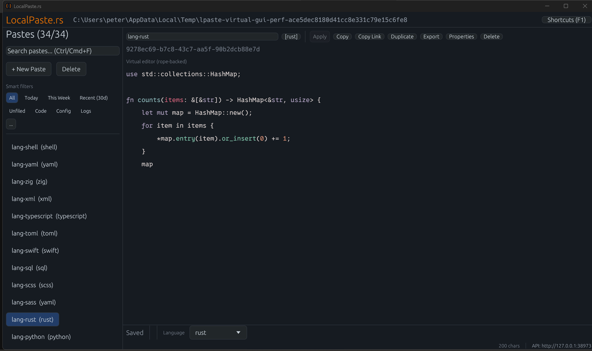

# LocalPaste.rs

LocalPaste stores technical text locally for editing, search, diff, and version recovery.



Save code snippets, logs, stack traces, config fragments, prompts, queries, links, and notes.

It is local-first by design. The desktop app is the main workspace, backed by an embedded database on your machine. A localhost API and the `lpaste` CLI can use the same store, so terminal capture, scripts, and the GUI can fit into one workflow without sending sensitive material to a cloud pastebin.

> [!WARNING]
> Follow the [storage operational expectations](docs/storage.md#operational-expectations) when combining GUI, server, and CLI workflows.

## Quick Start

Download the latest binary for your system from
[GitHub Releases](https://github.com/pszemraj/localpaste.rs/releases), then install and run LocalPaste.
Release downloads install the desktop GUI; build from source for `lpaste` or the standalone server.
See [GUI releases](docs/release-gui.md) for artifact names and platform installation details.

Source builds need Git, Rust 1.89 or newer with Cargo, and a native C/C++ build
toolchain. Linux builds also need `pkg-config`.

```bash
git clone https://github.com/pszemraj/localpaste.rs.git
cd localpaste.rs
rustc --version
cargo --version
cargo run
```

In the GUI, press `Ctrl/Cmd+N`, enter some text, and press `Ctrl/Cmd+S` to save it.
The saved paste appears in the sidebar.

Default GUI/server builds use Magika; see [detection build options](docs/language-detection.md#feature-topology)
if ONNX Runtime is unavailable on your platform.

Use the standalone server and CLI when you want a headless workflow:

```bash
# Terminal A: run the server on the default local endpoint, 127.0.0.1:38411
cargo run -p localpaste_server --bin localpaste

# Terminal B: create and list pastes through the CLI
echo "hello from quickstart" | cargo run -p localpaste_cli --bin lpaste -- new --name "quickstart"
cargo run -p localpaste_cli --bin lpaste -- list --limit 5
```

For endpoint selection, GUI discovery, and terminal examples, see
[CLI workflows](docs/cli-gui-workflows.md).

## Documentation

Start here:

- Terminal workflows with the GUI: [`docs/cli-gui-workflows.md`](docs/cli-gui-workflows.md)
- Language detection and highlighting: [`docs/language-detection.md`](docs/language-detection.md#feature-topology)
- Storage and durability: [`docs/storage.md`](docs/storage.md)
- Security, exposure, and configuration: [`docs/security.md`](docs/security.md#environment-variables)
- Deployment and service operations: [`docs/deployment.md`](docs/deployment.md)
- Full documentation map: [`docs/README.md`](docs/README.md)

For development:

- Build, validation, and smoke-test workflow: [`docs/dev/devlog.md`](docs/dev/devlog.md)
- GUI behavior notes, navigation probe, and manual test checklist: [`docs/dev/gui-notes.md`](docs/dev/gui-notes.md)

## License

MIT
