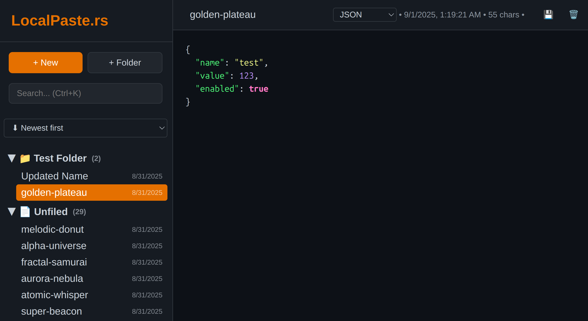

# LocalPaste.rs


A fast, localhost-only pastebin with a modern editor, built in Rust.



---

## Features

- **Self-Contained** - Zero runtime dependencies, just run and go
- **Language Detection** - Auto-detects programming language
- **Auto-Save** - Changes save automatically after 1 second
- **Folder Organization** - Drag & drop pastes into folders
- **Semantic Naming** - Auto-generates memorable names (e.g., "mythic-ruby")
- **Fast Search** - Search through all your pastes instantly
- **Keyboard Shortcuts** - Ctrl+N (new), Ctrl+K (search), Ctrl+D (delete)
- **Dark Theme** - Native dark theme with Rust-themed colors

## Quick Start

LocalPaste.rs provides two ways to interact with your pastes:

- `localpaste` - The web server with UI (main application)
- `lpaste` - Command-line interface for terminal usage

### Run the Server

```bash
# Run with cargo (development)
cargo run --bin localpaste --release

# Or build and run the binary (production)
cargo build --release
./target/release/localpaste
```

Open <http://localhost:3030> in your browser.

## CLI Usage

The CLI tool (`lpaste`) interacts with the running server:

```bash
# Build the CLI binary
cargo build --release --bin lpaste

# List all pastes
./target/release/lpaste list

# Create a new paste
echo "Hello, World!" | ./target/release/lpaste new

# Get a specific paste
./target/release/lpaste get <paste-id>

# Search pastes
./target/release/lpaste search "rust"

# Delete a paste
./target/release/lpaste delete <paste-id>
```

## Configuration

Copy `.env.example` to `.env` to customize settings:

```bash
cp .env.example .env
```

Available environment variables:

- `PORT` - Server port (default: 3030)
- `DB_PATH` - Database path (default: ~/.cache/localpaste/db)
- `MAX_PASTE_SIZE` - Maximum paste size in bytes (default: 10MB)
- `AUTO_BACKUP` - Enable automatic backups on startup (default: false)
- `RUST_LOG` - Logging level (default: info)

For advanced configuration and security settings, see [docs/security.md](docs/security.md).

## Running as a Background Service

LocalPaste can run automatically in the background. See [docs/deployment.md](docs/deployment.md) for:

- systemd (Linux)
- launchd (macOS)
- Task Scheduler (Windows)
- Docker setup
- Process managers (PM2, Supervisor)
- Auto-restart scripts

## Development

See [docs/dev.md](docs/dev.md) for development documentation.

## Architecture

- **Backend**: Axum web framework with Sled embedded database
- **Frontend**: Vanilla JavaScript with custom syntax highlighting
- **Storage**: Embedded Sled database (no external DB required)
- **Deployment**: Single binary with embedded static assets

## License

MIT
