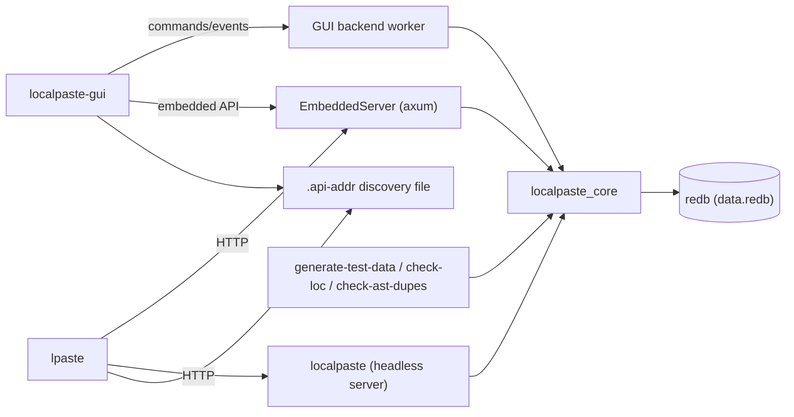
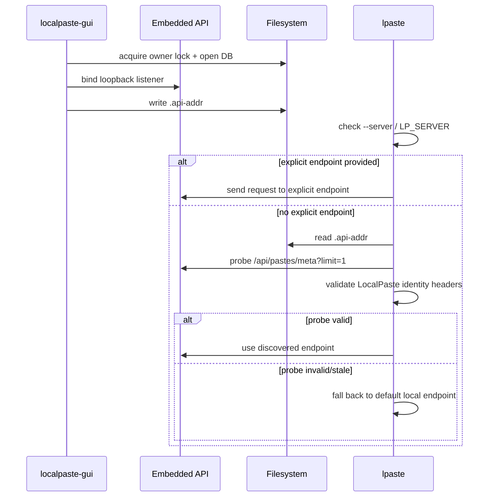
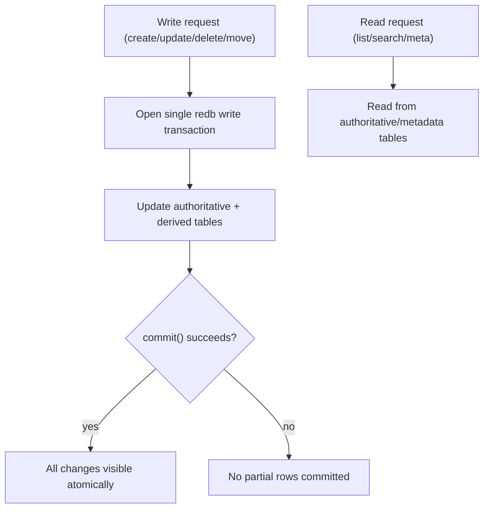

# LocalPaste Architecture

This document is the system walkthrough for LocalPaste.rs.

---

- [1) System At A Glance](#1-system-at-a-glance)
- [2) Runtime Topologies](#2-runtime-topologies)
- [3) Storage Design](#3-storage-design)
- [4) Consistency Model](#4-consistency-model)
- [5) Read And Write Paths](#5-read-and-write-paths)
- [6) Locking And Concurrency](#6-locking-and-concurrency)
- [7) HTTP Layer And Security Boundaries](#7-http-layer-and-security-boundaries)
- [8) Language Detection And Highlighting](#8-language-detection-and-highlighting)
- [9) GUI Save Pipeline](#9-gui-save-pipeline)
- [10) Discovery And Trust](#10-discovery-and-trust)
- [11) Validation Strategy](#11-validation-strategy)
- [12) Active Follow-Ups](#12-active-follow-ups)

---

## 1) System At A Glance

LocalPaste is a local-first paste manager with a shared core and multiple frontends:

- Desktop GUI (`localpaste-gui`) is the primary UX.
- Headless HTTP API server (`localpaste`) supports automation and integrations.
- CLI (`lpaste`) calls HTTP endpoints and can auto-discover the GUI embedded API.
- Tools (`generate-test-data`, `check-loc`, `check-ast-dupes`) support fixtures and repository hygiene.

Workspace crates:

- [`crates/localpaste_core`](crates/localpaste_core): config, models, storage, transaction helpers, invariants.
- [`crates/localpaste_server`](crates/localpaste_server): Axum routing, middleware, handlers, embedded server helper.
- [`crates/localpaste_gui`](crates/localpaste_gui): native app shell, backend worker, editor flows.
- [`crates/localpaste_cli`](crates/localpaste_cli): HTTP client and endpoint discovery logic.
- [`crates/localpaste_tools`](crates/localpaste_tools): test data generation and repo hygiene checks (`check-loc`, `check-ast-dupes`).



## 2) Runtime Topologies

### GUI-Primary Topology

`localpaste-gui`:

1. Opens the DB at `DB_PATH`.
2. Acquires process-lifetime owner lock.
3. Starts an embedded API server on loopback.
4. Writes embedded API endpoint to `DB_PATH/.api-addr`.
5. Runs UI and backend worker in-process.

CLI behavior in this mode:

- `lpaste` prefers explicit `--server` / `LP_SERVER`.
- If unset and discovery is enabled, it reads `.api-addr`, validates discovered endpoint identity, and only then uses it.
- If validation fails, it falls back to the default local endpoint.
- `--no-discovery` disables `.api-addr` probing and uses only explicit/env/default resolution.

### Headless Topology

`localpaste`:

1. Opens the DB at `DB_PATH`.
2. Acquires owner lock.
3. Binds HTTP listener (`BIND` or loopback default).
4. Serves API requests until shutdown.

Important invariant:

- Do not run standalone `localpaste` and `localpaste-gui` against the same `DB_PATH` concurrently.

> [!IMPORTANT]
> LocalPaste enforces a single writer per `DB_PATH`. Run GUI and standalone server on separate DB paths when both are needed.



## 3) Storage Design

Storage contract and compatibility policy are defined in
[docs/storage.md](docs/storage.md).
Architecture summary:

Primary tables:

- `pastes`: authoritative full paste rows.
- `folders`: authoritative folder rows.
- `folders_deleting`: in-progress delete markers for folder-tree operations.

Derived/index tables:

- `pastes_meta`: metadata projection for list/search.
- `pastes_by_updated`: recency ordering index keyed by `(reverse_millis, paste_id)`.

Primary implementation:

- [`crates/localpaste_core/src/db/mod.rs`](crates/localpaste_core/src/db/mod.rs)
- [`crates/localpaste_core/src/db/paste/mod.rs`](crates/localpaste_core/src/db/paste/mod.rs)
- [`crates/localpaste_core/src/db/folder.rs`](crates/localpaste_core/src/db/folder.rs)

## 4) Consistency Model

redb write transactions are atomic across all opened tables, so LocalPaste now uses:

- single-write-transaction mutations for paste/meta/index/folder updates,
- no metadata fault markers or reconcile state machine,
- no cross-table rollback stack for folder-affecting operations.

Core transaction helper:

- [`crates/localpaste_core/src/db/transactions.rs`](crates/localpaste_core/src/db/transactions.rs)

Folder shared operations and invariant repair:

- [`crates/localpaste_core/src/folder_ops.rs`](crates/localpaste_core/src/folder_ops.rs)



## 5) Read And Write Paths

Write surfaces:

- API handlers (`localpaste_server`),
- GUI backend worker (`localpaste_gui`),
- tooling (`localpaste_tools`).

The project centralizes sensitive folder assignment/delete logic in shared core helpers so API and GUI backend paths enforce equivalent invariants.

Read behavior:

- list/search use metadata/index projections backed by atomic write consistency,
- no stale-index authoritative-table fallback path is required.

## 6) Locking And Concurrency

Two lock layers are used:

1. DB owner lock (filesystem/process-wide): one writer process per DB path.
2. Paste edit locks (in-memory/paste-scoped): prevent API/CLI/bulk mutations on GUI-open pastes.

Lock reference:

- [docs/dev/locking-model.md](docs/dev/locking-model.md)

Primary implementation:

- [`crates/localpaste_core/src/db/lock.rs`](crates/localpaste_core/src/db/lock.rs)
- [`crates/localpaste_server/src/locks.rs`](crates/localpaste_server/src/locks.rs)

## 7) HTTP Layer And Security Boundaries

Axum router and middleware live in:

- [`crates/localpaste_server/src/lib.rs`](crates/localpaste_server/src/lib.rs)

Current boundary rules:

- strict mode binds loopback unless public access is explicitly enabled,
- strict CORS is loopback + listener-port scoped (not any loopback origin),
- security headers are always set (`CSP`, `X-Frame-Options`, `X-Content-Type-Options`),
- server identity header (`x-localpaste-server: 1`) is set for trust checks.

## 8) Language Detection And Highlighting

Detection/highlight behavior is defined in
[docs/language-detection.md](docs/language-detection.md).
Architecture-level summary:

- Detection is centralized in `localpaste_core::detection`.
- `localpaste_core` keeps `magika` opt-in; GUI/server enable it by default, CLI remains heuristic-only by default.
- Auto-detect flow is `Magika -> heuristic fallback`, with label normalization before persistence/filtering.
- Manual language mode bypasses auto re-detection on content edits.
- GUI highlighting resolves syntaxes via a multi-step resolver and falls back to plain text when no safe grammar match exists.
- Virtual-editor async highlight debounce/staging/patch behavior is defined in [docs/language-detection.md](docs/language-detection.md#virtual-editor-async-highlight-flow).

## 9) GUI Save Pipeline

The GUI uses a command/event backend worker so UI rendering stays non-blocking.

Key properties:

- autosave and keyboard-triggered manual saves dispatch through backend commands,
- metadata save path is separate from content save path,
- shutdown force-enqueues final dirty snapshots before backend shutdown acknowledgement.

Relevant code:

- [`crates/localpaste_gui/src/app/state_ops.rs`](crates/localpaste_gui/src/app/state_ops.rs)
- [`crates/localpaste_gui/src/app/shutdown.rs`](crates/localpaste_gui/src/app/shutdown.rs)
- [`crates/localpaste_gui/src/backend/worker.rs`](crates/localpaste_gui/src/backend/worker.rs)

```mermaid
sequenceDiagram
    participant UI as GUI App
    participant W as Backend Worker
    participant DB as redb

    UI->>UI: detect dirty content/metadata on exit
    UI->>W: enqueue final content save (forced)
    UI->>W: enqueue final metadata save (forced)
    UI->>W: send Shutdown{flush=true} (compat flag; redb commits on write commit)
    W->>DB: process queued saves in order
    W->>DB: commit() per mutation
    W-->>UI: ShutdownComplete
```

## 10) Discovery And Trust

Embedded server discovery path:

- GUI writes `.api-addr`.
- CLI may consume it only when no explicit endpoint override is set.
- CLI validates:
  - scheme/loopback constraints,
  - LocalPaste response fingerprint (including `x-localpaste-server` header).

Relevant code:

- [`crates/localpaste_server/src/embedded.rs`](crates/localpaste_server/src/embedded.rs)
- [`crates/localpaste_cli/src/main.rs`](crates/localpaste_cli/src/main.rs)

## 11) Validation Strategy

Repository-level quality gates are defined in:

- [AGENTS.md](AGENTS.md)
- [docs/dev/devlog.md](docs/dev/devlog.md)

Core themes:

- full workspace fmt/lint/check/build loop,
- explicit smoke tests for API/core changes,
- rustdoc checks,
- line-count policy checks,
- targeted regression tests for lock/invariant/shutdown edge cases.

## 12) Active Follow-Ups

- Engineering backlog: [docs/dev/backlog.md](docs/dev/backlog.md)
- GUI perf validation protocol: [docs/dev/gui-perf-protocol.md](docs/dev/gui-perf-protocol.md)
