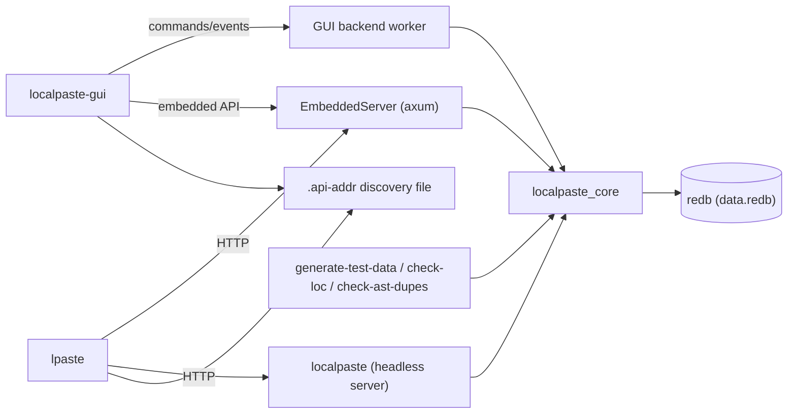
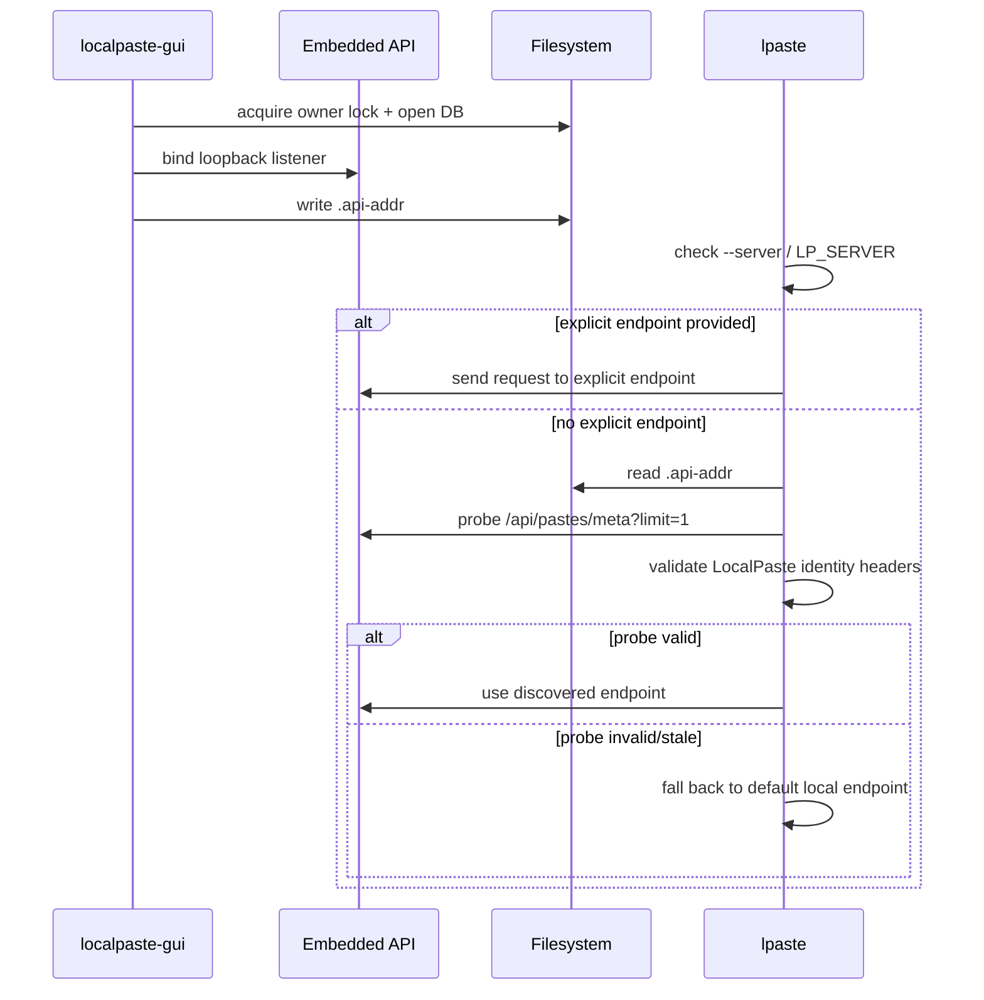
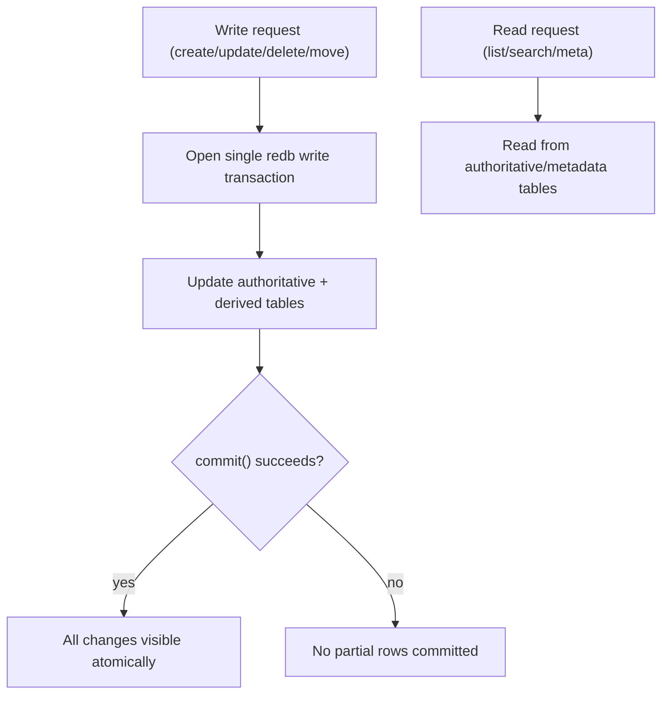

# LocalPaste Architecture

---

- [1) System At A Glance](#1-system-at-a-glance)
- [2) Runtime Topologies](#2-runtime-topologies)
- [3) Storage Design](#3-storage-design)
- [4) Consistency Model](#4-consistency-model)
- [5) Read And Write Paths](#5-read-and-write-paths)
- [6) Locking And Concurrency](#6-locking-and-concurrency)
- [7) HTTP Layer And Security Boundaries](#7-http-layer-and-security-boundaries)
- [8) Language Detection And Highlighting](#8-language-detection-and-highlighting)
- [9) GUI Save Pipeline](#9-gui-save-pipeline)
- [10) Discovery And Trust](#10-discovery-and-trust)
- [11) Validation Strategy](#11-validation-strategy)

## 1) System At A Glance

LocalPaste is a local-first paste manager with a shared core and multiple frontends:

- Desktop GUI (`localpaste-gui`) is the primary UX.
- Headless HTTP API server (`localpaste`) supports automation and integrations.
- CLI (`lpaste`) calls HTTP endpoints and can auto-discover the GUI embedded API.
- Tools (`generate-test-data`, `check-loc`, `check-ast-dupes`) support fixtures and repository hygiene.

Workspace crates:

- [`../crates/localpaste_core`](../crates/localpaste_core): config, models, storage, transaction helpers, invariants.
- [`../crates/localpaste_server`](../crates/localpaste_server): Axum routing, middleware, handlers, embedded server helper.
- [`../crates/localpaste_gui`](../crates/localpaste_gui): native app shell, backend worker, editor flows.
- [`../crates/localpaste_cli`](../crates/localpaste_cli): HTTP client and endpoint discovery logic.
- [`../crates/localpaste_tools`](../crates/localpaste_tools): test data generation and repo hygiene checks (`check-loc`, `check-ast-dupes`).

```mermaid
flowchart LR
    GUI["localpaste-gui"] -->|"commands/events"| GUIB["GUI backend worker"]
    GUI -->|"embedded API"| ES["EmbeddedServer (axum)"]
    CLI["lpaste"] -->|"HTTP"| ES
    CLI -->|"HTTP"| HS["localpaste (headless server)"]
    TOOLS["generate-test-data / check-loc / check-ast-dupes"] --> CORE["localpaste_core"]
    ES --> CORE
    HS --> CORE
    GUIB --> CORE
    CORE --> DB[("redb (data.redb)")]
    GUI --> DISC[".api-addr discovery file"]
    CLI --> DISC
```

## 2) Runtime Topologies

### GUI-Primary Topology

`localpaste-gui`:

1. Opens the DB at `DB_PATH`.
2. Acquires process-lifetime owner lock.
3. Starts an embedded API server on loopback.
4. Writes embedded API endpoint to `DB_PATH/.api-addr`.
5. Runs UI and backend worker in-process.

CLI endpoint selection follows [Discovery And Trust](#10-discovery-and-trust).

### Headless Topology

`localpaste`:

1. Opens the DB at `DB_PATH`.
2. Acquires owner lock.
3. Binds HTTP listener (`BIND` or loopback default).
4. Serves API requests until shutdown.

DB ownership rules for both topologies are in [storage.md#operational-expectations](storage.md#operational-expectations).

```mermaid
sequenceDiagram
    participant GUI as localpaste-gui
    participant API as Embedded API
    participant FS as Filesystem
    participant CLI as lpaste

    GUI->>FS: acquire owner lock + open DB
    GUI->>API: bind loopback listener
    GUI->>FS: write .api-addr
    CLI->>CLI: check --server / LP_SERVER
    alt explicit endpoint provided
        CLI->>API: send request to explicit endpoint
    else no explicit endpoint
        CLI->>FS: read .api-addr
        CLI->>API: probe /api/pastes/meta?limit=1
        CLI->>CLI: validate LocalPaste identity headers
        alt probe valid
            CLI->>API: use discovered endpoint
        else probe invalid/stale
            CLI->>CLI: fall back to default local endpoint
        end
    end
```

## 3) Storage Design

Storage layout, projection tables, version-history storage, durability, and compatibility policy are defined in [storage.md](storage.md).

- [`../crates/localpaste_core/src/db/mod.rs`](../crates/localpaste_core/src/db/mod.rs)
- [`../crates/localpaste_core/src/db/paste/mod.rs`](../crates/localpaste_core/src/db/paste/mod.rs)
- [`../crates/localpaste_core/src/db/folder.rs`](../crates/localpaste_core/src/db/folder.rs)

## 4) Consistency Model

The [storage atomicity contract](storage.md#durability-and-atomicity) applies to paste, metadata, recency-index, and folder updates.

Core transaction helper:

- [`../crates/localpaste_core/src/db/transactions.rs`](../crates/localpaste_core/src/db/transactions.rs)

Folder shared operations and invariant repair:

- [`../crates/localpaste_core/src/folder_ops.rs`](../crates/localpaste_core/src/folder_ops.rs)

```mermaid
flowchart TD
    W["Write request (create/update/delete/move)"] --> T["Open single redb write transaction"]
    T --> C["Update authoritative + derived tables"]
    C --> K{"commit() succeeds?"}
    K -- yes --> OK["All changes visible atomically"]
    K -- no --> ABORT["No partial rows committed"]

    R["Read request (list/search/meta)"] --> I["Read from authoritative/metadata tables"]
```

## 5) Read And Write Paths

Write surfaces:

- API handlers (`localpaste_server`),
- GUI backend worker (`localpaste_gui`),
- tooling (`localpaste_tools`).

Folder API pathways remain for compatibility and emit deprecation headers; the GUI organizes pastes through smart filters and search. Folder assignment/delete invariants stay in shared core helpers so API and GUI backend paths enforce equivalent behavior.

Version and diff surfaces:

- `/api/paste/:id/versions*` supports list/get/reset-hard/duplicate for historical snapshots.
- `/api/diff` compares head or historical paste references and rejects combined
  diff sources above 1 MiB with `413 Payload Too Large`.
- Content-changing writes may persist an older-head snapshot. Snapshot interval and retention behavior are defined in [storage.md#version-history-storage](storage.md#version-history-storage).

Read behavior:

- list/search use metadata/index projections backed by atomic write consistency,
- metadata search ranks against `name`, derived handle/terms, tags, and
  normalized language without deserializing full paste content in the hot path,
- no stale-index authoritative-table fallback path is required.

## 6) Locking And Concurrency

See the [lock layers and mutation guards](dev/locking-model.md).

## 7) HTTP Layer And Security Boundaries

Axum router and middleware live in:

- [`../crates/localpaste_server/src/lib.rs`](../crates/localpaste_server/src/lib.rs)

Security defaults, public-bind policy, CORS behavior, request-size limits, and browser security headers are defined in [security.md](security.md).

## 8) Language Detection And Highlighting

Detection, normalization, manual-language behavior, syntax resolution, and virtual-editor highlight staging are defined in [language-detection.md](language-detection.md).

## 9) GUI Save Pipeline

The GUI uses a command/event backend worker so UI rendering stays non-blocking.

Key properties:

- autosave and keyboard-triggered manual saves dispatch through backend commands,
- metadata save path is separate from content save path,
- shutdown force-enqueues final dirty snapshots before backend shutdown acknowledgement.

Relevant code:

- [`../crates/localpaste_gui/src/app/state_ops.rs`](../crates/localpaste_gui/src/app/state_ops.rs)
- [`../crates/localpaste_gui/src/app/shutdown.rs`](../crates/localpaste_gui/src/app/shutdown.rs)
- [`../crates/localpaste_gui/src/backend/worker.rs`](../crates/localpaste_gui/src/backend/worker.rs)

```mermaid
sequenceDiagram
    participant UI as GUI App
    participant W as Backend Worker
    participant DB as redb

    UI->>UI: detect dirty content/metadata on exit
    UI->>W: enqueue final content save (forced)
    UI->>W: enqueue final metadata save (forced)
    UI->>W: send Shutdown{flush=true} (compat flag; redb commits on write commit)
    W->>DB: process queued saves in order
    W->>DB: commit() per mutation
    W-->>UI: ShutdownComplete
```

## 10) Discovery And Trust

Embedded server discovery path:

- `lpaste` prefers explicit `--server` / `LP_SERVER`.
- If unset and discovery is enabled, it reads the GUI's `.api-addr` file and validates the discovered endpoint before using it.
- If validation fails, it falls back to the default local endpoint.
- `--no-discovery` disables `.api-addr` probing and uses only explicit/env/default resolution.
- CLI validates:
  - an HTTP URL with a loopback host,
  - a successful `200` response from `/api/pastes/meta?limit=1`,
  - JSON content type, `X-Content-Type-Options: nosniff`, `X-Frame-Options: DENY`, and `x-localpaste-server: 1` headers.

The probe uses 250 ms connection/read/write timeouts. These checks reject stale or unrelated endpoints; the headers identify a compatible API but do not authenticate a local process.

Relevant code:

- [`../crates/localpaste_server/src/embedded.rs`](../crates/localpaste_server/src/embedded.rs)
- [`../crates/localpaste_cli/src/discovery.rs`](../crates/localpaste_cli/src/discovery.rs)

## 11) Validation Strategy

- [dev/devlog.md#validation-loop](dev/devlog.md#validation-loop)
- [dev/devlog.md#runtime-smoke-test-server-cli](dev/devlog.md#runtime-smoke-test-server-cli)
- [dev/gui-notes.md#manual-gui-human-step-checklist-comprehensive](dev/gui-notes.md#manual-gui-human-step-checklist-comprehensive)
- [dev/gui-perf-protocol.md](dev/gui-perf-protocol.md)
