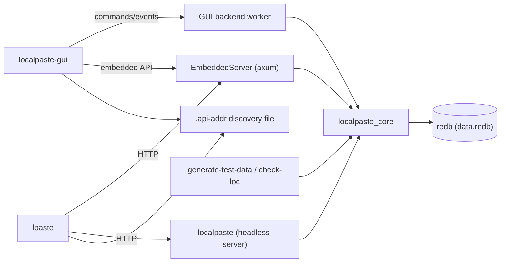
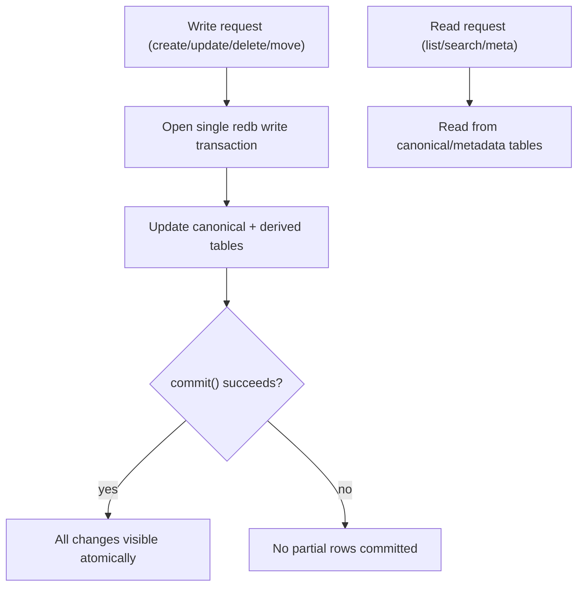

# LocalPaste Architecture

This document is the canonical system walkthrough for LocalPaste.rs.
For command-level developer workflows, use [docs/dev/devlog.md](https://github.com/pszemraj/localpaste.rs/blob/main/docs/dev/devlog.md).
For security posture, use [docs/security.md](https://github.com/pszemraj/localpaste.rs/blob/main/docs/security.md).
For service operations, use [docs/deployment.md](https://github.com/pszemraj/localpaste.rs/blob/main/docs/deployment.md).

## 1) System At A Glance

LocalPaste is a local-first paste manager with a shared core and multiple frontends:

- Desktop GUI (`localpaste-gui`) is the primary UX.
- Headless HTTP API server (`localpaste`) supports automation and integrations.
- CLI (`lpaste`) calls HTTP endpoints and can auto-discover the GUI embedded API.
- Tools (`generate-test-data`, `check-loc`) support fixtures and repository hygiene.

Workspace crates:

- [`crates/localpaste_core`](https://github.com/pszemraj/localpaste.rs/blob/main/crates/localpaste_core): config, models, storage, transaction helpers, invariants.
- [`crates/localpaste_server`](https://github.com/pszemraj/localpaste.rs/blob/main/crates/localpaste_server): Axum routing, middleware, handlers, embedded server helper.
- [`crates/localpaste_gui`](https://github.com/pszemraj/localpaste.rs/blob/main/crates/localpaste_gui): native app shell, backend worker, editor flows.
- [`crates/localpaste_cli`](https://github.com/pszemraj/localpaste.rs/blob/main/crates/localpaste_cli): HTTP client and endpoint discovery logic.
- [`crates/localpaste_tools`](https://github.com/pszemraj/localpaste.rs/blob/main/crates/localpaste_tools): test data generation and line-count checks.



## 2) Runtime Topologies

### GUI-Primary Topology

`localpaste-gui`:

1. Opens the DB at `DB_PATH`.
2. Acquires process-lifetime owner lock.
3. Starts an embedded API server on loopback.
4. Writes embedded API endpoint to `DB_PATH/.api-addr`.
5. Runs UI and backend worker in-process.

CLI behavior in this mode:

- `lpaste` prefers explicit `--server` / `LP_SERVER`.
- If unset and discovery is enabled, it reads `.api-addr`, validates discovered endpoint identity, and only then uses it.
- If validation fails, it falls back to the default local endpoint.
- `--no-discovery` disables `.api-addr` probing and uses only explicit/env/default resolution.

### Headless Topology

`localpaste`:

1. Opens the DB at `DB_PATH`.
2. Acquires owner lock.
3. Binds HTTP listener (`BIND` or loopback default).
4. Serves API requests until shutdown.

Important invariant:

- Do not run standalone `localpaste` and `localpaste-gui` against the same `DB_PATH` concurrently.


## 3) Storage Design

LocalPaste uses redb 3.x with typed tables in a single database file at `DB_PATH/data.redb`.

Canonical tables:

- `pastes`: authoritative full paste rows.
- `folders`: authoritative folder rows.
- `folders_deleting`: in-progress delete markers for folder-tree operations.

Derived/index tables:

- `pastes_meta`: metadata projection for list/search.
- `pastes_by_updated`: recency ordering index keyed by `(reverse_millis, paste_id)`.

Primary implementation:

- [`crates/localpaste_core/src/db/mod.rs`](https://github.com/pszemraj/localpaste.rs/blob/main/crates/localpaste_core/src/db/mod.rs)
- [`crates/localpaste_core/src/db/paste/mod.rs`](https://github.com/pszemraj/localpaste.rs/blob/main/crates/localpaste_core/src/db/paste/mod.rs)
- [`crates/localpaste_core/src/db/folder.rs`](https://github.com/pszemraj/localpaste.rs/blob/main/crates/localpaste_core/src/db/folder.rs)

## 4) Consistency Model

redb write transactions are atomic across all opened tables, so LocalPaste now uses:

- single-write-transaction mutations for paste/meta/index/folder updates,
- no metadata fault markers or reconcile state machine,
- no cross-table rollback stack for folder-affecting operations.

Core transaction helper:

- [`crates/localpaste_core/src/db/transactions.rs`](https://github.com/pszemraj/localpaste.rs/blob/main/crates/localpaste_core/src/db/transactions.rs)

Folder shared operations and invariant repair:

- [`crates/localpaste_core/src/folder_ops.rs`](https://github.com/pszemraj/localpaste.rs/blob/main/crates/localpaste_core/src/folder_ops.rs)



## 5) Read And Write Paths

Write surfaces:

- API handlers (`localpaste_server`),
- GUI backend worker (`localpaste_gui`),
- tooling (`localpaste_tools`).

The project centralizes sensitive folder assignment/delete logic in shared core helpers so API and GUI backend paths enforce equivalent invariants.

Read behavior:

- list/search use metadata/index projections backed by atomic write consistency,
- no stale-index canonical fallback path is required.

## 6) Locking And Concurrency

Two lock layers are used:

1. DB owner lock (filesystem/process-wide): one writer process per DB path.
2. Paste edit locks (in-memory/paste-scoped): prevent API/CLI/bulk mutations on GUI-open pastes.

Canonical lock reference:

- [docs/dev/locking-model.md](https://github.com/pszemraj/localpaste.rs/blob/main/docs/dev/locking-model.md)

Primary implementation:

- [`crates/localpaste_core/src/db/lock.rs`](https://github.com/pszemraj/localpaste.rs/blob/main/crates/localpaste_core/src/db/lock.rs)
- [`crates/localpaste_server/src/locks.rs`](https://github.com/pszemraj/localpaste.rs/blob/main/crates/localpaste_server/src/locks.rs)

## 7) HTTP Layer And Security Boundaries

Axum router and middleware live in:

- [`crates/localpaste_server/src/lib.rs`](https://github.com/pszemraj/localpaste.rs/blob/main/crates/localpaste_server/src/lib.rs)

Current boundary rules:

- strict mode binds loopback unless public access is explicitly enabled,
- strict CORS is loopback + listener-port scoped (not any loopback origin),
- security headers are always set (`CSP`, `X-Frame-Options`, `X-Content-Type-Options`),
- server identity header (`x-localpaste-server: 1`) is set for trust checks.

## 8) GUI Save Pipeline

The GUI uses a command/event backend worker so UI rendering stays non-blocking.

Key properties:

- autosave and manual save dispatch through backend commands,
- metadata save path is separate from content save path,
- shutdown force-enqueues final dirty snapshots before backend shutdown acknowledgement.

Relevant code:

- [`crates/localpaste_gui/src/app/state_ops.rs`](https://github.com/pszemraj/localpaste.rs/blob/main/crates/localpaste_gui/src/app/state_ops.rs)
- [`crates/localpaste_gui/src/app/shutdown.rs`](https://github.com/pszemraj/localpaste.rs/blob/main/crates/localpaste_gui/src/app/shutdown.rs)
- [`crates/localpaste_gui/src/backend/worker.rs`](https://github.com/pszemraj/localpaste.rs/blob/main/crates/localpaste_gui/src/backend/worker.rs)

```mermaid
sequenceDiagram
    participant UI as GUI App
    participant W as Backend Worker
    participant DB as redb

    UI->>UI: detect dirty content/metadata on exit
    UI->>W: enqueue final content save (forced)
    UI->>W: enqueue final metadata save (forced)
    UI->>W: send Shutdown{flush=true} (compat flag; redb commits on write commit)
    W->>DB: process queued saves in order
    W->>DB: commit() per mutation
    W-->>UI: ShutdownComplete
```

## 9) Discovery And Trust

Embedded server discovery path:

- GUI writes `.api-addr`.
- CLI may consume it only when no explicit endpoint override is set.
- CLI validates:
  - scheme/loopback constraints,
  - LocalPaste response fingerprint (including `x-localpaste-server` header).

Relevant code:

- [`crates/localpaste_server/src/embedded.rs`](https://github.com/pszemraj/localpaste.rs/blob/main/crates/localpaste_server/src/embedded.rs)
- [`crates/localpaste_cli/src/main.rs`](https://github.com/pszemraj/localpaste.rs/blob/main/crates/localpaste_cli/src/main.rs)

## 10) Validation Strategy

Repository-level quality gates are defined in:

- [AGENTS.md](https://github.com/pszemraj/localpaste.rs/blob/main/AGENTS.md)
- [docs/dev/devlog.md](https://github.com/pszemraj/localpaste.rs/blob/main/docs/dev/devlog.md)

Core themes:

- full workspace fmt/lint/check/build loop,
- explicit smoke tests for API/core changes,
- rustdoc checks,
- line-count policy checks,
- targeted regression tests for lock/invariant/shutdown edge cases.

## 11) Active Follow-Ups

- Storage split design follow-up: [docs/dev/storage-split-plan.md](https://github.com/pszemraj/localpaste.rs/blob/main/docs/dev/storage-split-plan.md)
- Rewrite readiness/perf gate: [docs/dev/parity-checklist.md](https://github.com/pszemraj/localpaste.rs/blob/main/docs/dev/parity-checklist.md)
- Engineering backlog: [docs/dev/backlog.md](https://github.com/pszemraj/localpaste.rs/blob/main/docs/dev/backlog.md)
