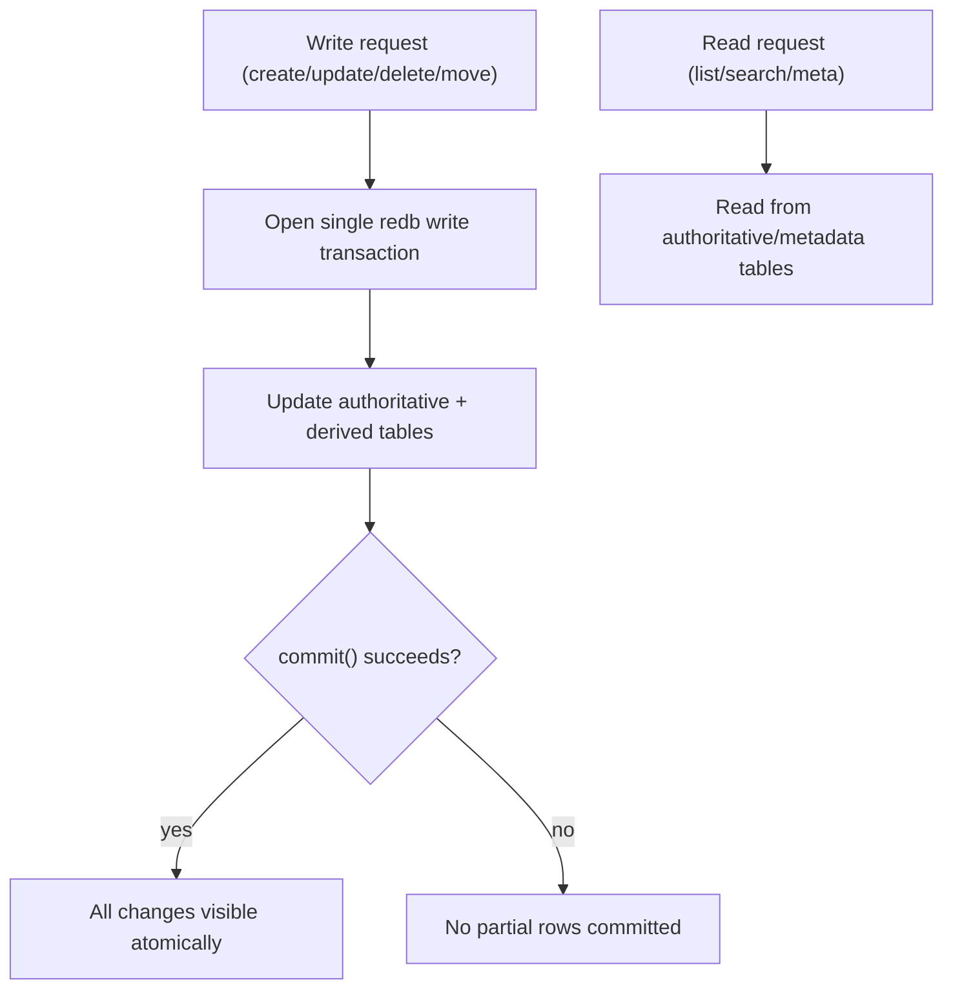

# Storage Contract

LocalPaste keeps pastes, folders, and version history in one redb database under `DB_PATH`. This page states what that database keeps, how it is laid out, and what to expect when it is shared or upgraded.

## What Survives What

Pastes, folders, and version history are committed durably and survive restarts. Delete undo does not.

- **Version history** is stored with the paste and persists across restarts. When a paste's content changes, the previous content is saved as a snapshot, subject to the interval and retention limits in [Version History Storage](#version-history-storage). Deleting a paste deletes its history, so history cannot bring a deleted paste back.
- **Delete undo** is a short GUI affordance, not a recovery mechanism. The GUI holds a deleted paste for about ten seconds so Undo can restore it. Any database startup discards what is still held, and a delete through the API or CLI is permanent immediately.
- **Backups** are separate database files, created on request or before a startup repair and never on a schedule ([deployment.md](deployment.md#backups)). Restoring a backup taken before the deletion is the only way to recover a deleted paste. A backup holds the pastes and history that existed when it was taken; undo data inside a backup is discarded when it is opened.

## Backend And File Layout

- Storage backend: `redb` 3.x.
- Database file: `DB_PATH/data.redb`.
- Writer coordination lock file: `DB_PATH/db.owner.lock`.
- Embedded GUI endpoint discovery file (GUI runtime only): `DB_PATH/.api-addr`.

## Tables And Projections

Authoritative tables:

- `pastes`: full paste rows.
- `folders`: folder rows.
- `folders_deleting`: in-progress delete markers for folder-tree operations.

Rebuildable projections and indexes:

- `pastes_meta`: list/search/filter projection, including derived retrieval metadata (`kind`, compact `handle`, top `terms`).
- `pastes_meta_state`: projection schema marker; startup rebuilds `pastes_meta` from authoritative paste rows when the marker is missing or stale.
- `pastes_by_updated`: recency index keyed by `(reverse_millis, paste_id)`.

Retained history and delete-undo data (not reconstructible from the active paste rows):

- `paste_versions_meta`: newest-first historical snapshot metadata per paste.
- `paste_versions_content`: historical snapshot content keyed by `(paste_id, version_id_ms)`.
- `deleted_pastes`: GUI delete-undo staging rows keyed by undo token.
- `deleted_paste_versions_meta`: staged historical snapshot metadata keyed by undo token.
- `deleted_paste_versions_content`: staged historical snapshot content keyed by `(undo_token, version_id_ms)`.

## Version History Storage

A content-changing write archives the outgoing content as a snapshot in the same transaction, except when it matches the latest snapshot or the latest snapshot is younger than `LOCALPASTE_VERSION_INTERVAL_SECS`. The first change to a paste always records one. Retention pruning removes the oldest snapshot metadata and content rows in the same transaction. A write also prunes a history that exceeds a lowered `LOCALPASTE_VERSION_RETENTION_LIMIT`, even when it records no new snapshot. Both settings are listed in [security.md](security.md#environment-variables).

A hard reset to a snapshot removes the snapshots newer than it. The GUI first keeps the replaced content as a snapshot so it stays recoverable; the API's `reset-hard` endpoint does not.

### Delete Undo Staging

A GUI delete moves the paste and its snapshots into the `deleted_*` tables in the same transaction that removes the active rows and updates folder projections. Undo restores them by token. The GUI worker discards tokens that expire or exceed its undo limit. Database startup and GUI backend reinitialization discard every staged row, including live tokens, because the undo action does not survive a restart. Discarding a token removes the paste and its snapshots permanently.

## Compatibility Policy

LocalPaste is pre-stable: a database written by an earlier version is not guaranteed to open in a later one, and no migrations are provided. Derived data (`pastes_meta`, `pastes_by_updated`) is rebuilt at startup, but paste rows written in an older layout can make startup fail or leave the affected pastes unreadable, and a legacy sled directory (no `data.redb`) is refused with an error. If an existing database is rejected, point `DB_PATH` at a fresh directory.

### Startup Repair

When an existing database needs schema or projection repair, startup first writes a backup using the [backup layout](deployment.md#backups); if that backup fails, startup aborts instead of repairing in place. Repair rebuilds an outdated or missing `pastes_meta` projection from the paste rows, so content, language, and manual-language flags are preserved. The projection implements the [detection and retrieval rules](language-detection.md#filter-and-search-semantics) and its version is `CURRENT_PASTES_META_SCHEMA_VERSION` in `crates/localpaste_core/src/db/paste/mod.rs`.

### For Contributors

Row-shape changes are not migrated before the stable release: prefer the current schema and a fresh `DB_PATH` over a broad migration for older development builds. A temporary reader fallback must stay local to its decode helper, have regression coverage, give new fields deterministic defaults, and be cheap to delete. The existing fallbacks cover `pastes`, `pastes_meta`, and `paste_versions_meta` rows that predate the language, manual-language, and derived-metadata fields; they protect development databases and are not a compatibility guarantee. Bump `CURRENT_PASTES_META_SCHEMA_VERSION` whenever the persisted `PasteMeta` projection changes.

## Durability and Atomicity

redb write transactions are commit-durable; no separate flush is required. Coupled multi-table operations share one write transaction.

## Operational Expectations

A database has one writer process at a time; a second process fails to open the same `DB_PATH`.

- Do not run `localpaste-gui` and standalone `localpaste` concurrently on the same `DB_PATH`.
- If the GUI owns a DB, use its embedded API for CLI/automation access instead of starting standalone `localpaste` on that path.
- For isolated local testing, use distinct `DB_PATH` directories.
